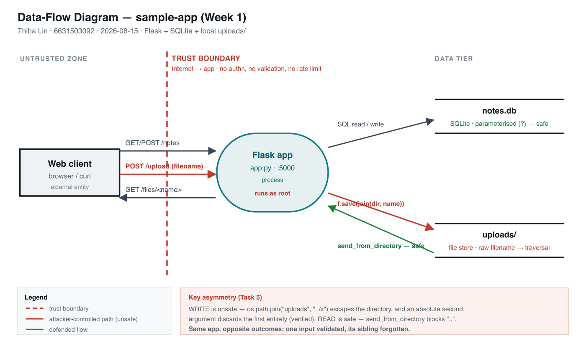

# Threat Model — sample-app (Week 1)

**Student:** Thiha Lin · 6631503092 · 2026-08-15
**Target:** `labs/week01-threat-modeling/sample-app/app.py` (Flask, SQLite, local `uploads/`)
**Runs on:** `http://localhost:8081` (host 8080 taken by another local service)
**Scope:** design analysis; the single before/after in §9 is the worksheet's Task-8 defense check.

---

## 1. Data-flow diagram



*Structure reference (same content as the image):*

```
                     Internet → app  ┊ (trust boundary, dashed)
                                     ┊
   ┌─────────────┐   /notes          ┊   ┌──────────────┐   SQL (parameterised)   ┌───────────────┐
   │  Web client │ ─ /upload ───────►┊──►│  Flask app   │ ──────────────────────► │ notes.db      │
   │ (browser/   │ ◄─ /files/<name> ─┊◄──│  (process,   │ ◄────────────────────── │ (SQLite store)│
   │  curl)      │                   ┊   │   :5000)     │                          └───────────────┘
   └─────────────┘                   ┊   │              │   f.save(path)           ┌───────────────┐
      external entity                ┊   │              │ ──────────────────────► │ uploads/      │
                                     ┊   └──────────────┘   ◄── send_from_directory│ (file store)  │
                                     ┊                                             └───────────────┘
```
*Dashed line = the only trust boundary, and it has no check on it. Source: `img/dfd-6631503092.svg`.*

---

## 2. Elements & trust boundaries

| Element | Type | Trust boundary crossed? |
|---|---|---|
| Web client | external entity | **yes** — Internet → app. Every request is untrusted input. |
| Flask app | process | The boundary enforcement point — and it enforces nothing: no authn, no authz, no validation. |
| SQLite DB (`notes.db`) | data store | app → data tier. Reached only via the app; queries use `?` placeholders → **no SQLi here.** |
| `uploads/` store | data store | app → filesystem. **Crossed with attacker-controlled data**: `f.filename` becomes a path component unmodified. |

---

## 3. STRIDE analysis (full)

| Element | S | T | R | I | D | E |
|---|---|---|---|---|---|---|
| **/notes** | client-supplied `owner`, no auth → post/read as anyone | no ownership check → tamper with any note in the shared table | no logging → no record of who wrote what | `GET /notes` returns **all** users' notes to any caller | unbounded body + ever-growing table, no rate limit → flood to exhaust disk/mem | seed `owner=admin`-style data a higher-trust component later trusts |
| **/upload** | no auth on who may upload → anonymous write | **saves raw `f.filename` → arbitrary file write (`../`)** | no logging of uploads | **echoes resolved save path** → leaks filesystem layout | no size/type/rate limit → fill disk | write into `/app` (served/executed dir) → code/content execution |
| **/files/<name>** | no auth → anyone reads any served file | read-only endpoint → low tampering risk | no logging of reads | **comparatively defended:** `send_from_directory` → `safe_join` rejects `..`/absolute paths on read (404/403) | repeated large fetches → minor DoS | low alone; serves back whatever `/upload` planted → part of a chain |

**Facts:** no authn/session anywhere · no logging anywhere → Repudiation is universal · no rate/size
caps → DoS surface · `notes.db` parameterised → not an injection finding · `/upload` has no
`secure_filename()` and no allow-list (before Task 8).

**Asymmetry worth noting:** the *read* path (`/files`) is safe because `send_from_directory`
contains traversal; the *write* path (`/upload`) is not. Same app, opposite outcomes — the classic
"one input validated, its sibling forgotten."

---

## 4. Task 3b — Systems-level pass

**Boundaries end-to-end.** One request crosses: (1) **Internet → Flask** on entry, and (2)
**Flask → data store** (`notes.db` *or* `uploads/`) inside. Crossing (1) has **no check at all** —
no authentication, no input validation, no rate limit. That single unguarded crossing is the whole
security posture of the app.

**Flask process fully owned →** attacker reaches: every note in `notes.db`, the entire `uploads/`
store (read/write/delete), the container filesystem **as root** (Dockerfile has no `USER`), and any
network the container can reach. Owning the process = owning all data + the power to serve malicious
content back through `/files`.

**`uploads/` fully owned →** because writes escape `uploads/` (the `../` bug), "owning uploads/" is
really "owning `/app`": the attacker reaches the app's own source (`app.py`), and anything the
process reads at runtime. The store's blast radius is not the store.

**Chain (two "low" findings → unacceptable):**
`/upload arbitrary write (rated modeling-only, "no exec this week")` → `overwrite /app/app.py (or
drop a file the app serves/imports)` → **persistent remote code execution.** Neither step looks
fatal in a per-element grid; together they are total compromise.

**System claim.** *Even if every element-level mitigation in Task 8 is implemented, this system
still fails if it keeps running as **root** with **no authentication boundary** — because missing
authn and root are system properties, not element bugs, so any single future element flaw is again
total.*

---

## 5. Task 4 — Abuse cases & attacker personas

**Persona A — Mallory (anonymous internet attacker; no account, just reaches the URL).**
- **AC-1:** Mallory `POST /upload` with `filename=../app.py` to overwrite the running app code
  (Tampering → EoP), against the `/upload` flow + Flask process.
- **AC-2:** Mallory `GET /notes` and harvests every user's notes (Information disclosure), against
  the `/notes` flow + `notes.db`.

**Persona B — Trudy (curious low-privilege user; treated as anon here since there's no auth, models
insider curiosity).**
- **AC-3:** Trudy `POST /notes` with `owner=admin` to plant authoritative-looking data others
  trust (Spoofing), against `/notes`.
- **AC-4:** Trudy uploads many large files right before a deadline to fill the disk and deny
  classmates service (DoS), against `/upload` + filesystem.

---

## 6. Task 5 — Path-traversal deep-dive

**Data flow.** client → `POST /upload` (multipart; `filename` attacker-controlled) →
`f.save(os.path.join("uploads", f.filename))`. `os.path.join("uploads","../pwned.txt")` =
`"uploads/../pwned.txt"`, which the OS resolves to the **parent** of `uploads/` (= `/app`). Later,
`GET /files/<name>` uses `send_from_directory`, which is **safe on read** (`safe_join` blocks `..`).
→ **Write is unsafe, read is safe** — the asymmetry from §3.

**Why `../` escapes.** `os.path.join` concatenates with a separator and does **not** normalise or
contain; a leading `..` walks up, and (verified) an **absolute** second argument discards the first
entirely: `os.path.join("uploads","/etc/passwd") == "/etc/passwd"`. Nothing checks the final path
stays under `uploads/`.

**Secure design.** (1) `secure_filename()` to strip separators and `..`; (2) store uploads
**outside** the app/web-served dir; (3) allow-list extensions + verify content type/magic bytes;
(4) generate a server-side random name, keep the original only as metadata; (5) enforce size limits;
(6) run the process **non-root**. **Class invariant:** *no user-supplied string ever becomes a path
component.*

---

## 7. Task 6 — NoteVault (term-project target) kickoff

DFD adds, over the sample app: a **login/session** flow (JWT cookie), a `/register` flow, a
`/search` flow, an `/admin` flow, and an `/export` flow — every one crossing the same unguarded
Internet→app boundary. **Top-3 STRIDE threats to investigate first:**
1. **SQLi login bypass** — `/login` builds the query by string-formatting (Tampering/EoP, CWE-89).
2. **JWT `alg:none` forgery** — decode allow-list includes `"none"`, so an unsigned token is
   trusted (Spoofing, CWE-347).
3. **Mass-assignment admin** — `/register` accepts a client-supplied `role` (EoP, CWE-269).

*(Full 16-finding map lives in the project assessment; these three seed the report.)*

---

## 8. Task 7 — Security requirements (acceptance criteria)

1. **The system must** authenticate the caller and bind each note to that identity, **so that** a
   client cannot create or read notes as another user. *(→ /notes Spoofing + Info disclosure)*
2. **The system must** reject any upload whose sanitized filename differs from the supplied name or
   whose extension is not in the allow-list, **so that** no user-supplied string becomes a path
   component. *(→ /upload Tampering)*
3. **The system must** write a timestamped, identity-attributed audit entry for every create /
   upload / read, **so that** actions are attributable and non-repudiable. *(→ Repudiation, all
   elements)*

---

## 9. Task 8 — Rank, mitigate, prove

| # | Threat | Element | L | I | Score | Mitigation |
|---|---|---|---|---|---|---|
| 1 | Arbitrary file write via path traversal | /upload | High | High | **Critical** | `secure_filename()` + allow-list — **IMPLEMENTED** |
| 2 | Read all users' notes (no authz) | GET /notes | High | High | **Critical** | authn + per-owner query filter |
| 3 | Impersonation via client-supplied `owner` | POST /notes | High | Med | High | authn; derive `owner` from session |
| 4 | No audit logging (repudiation) | all | Med | Med | Med | structured request logging |
| 5 | Disk/CPU exhaustion (no limits) | /upload,/notes | Med | Med | Med | `MAX_CONTENT_LENGTH` + rate limit |

**Implemented: #1.** Commit **`c254723`** on `wk01`.

**Before (unfixed):**
```
$ curl -s -X POST localhost:8081/upload -F "file=@demo.txt;filename=../pwned_before.txt"
{"saved":"../pwned_before.txt"}
$ docker exec …-sample-app-1 ls -la /app/pwned_before.txt
-rw-r--r-- 1 root root 13 … /app/pwned_before.txt      ← escaped uploads/, landed in /app
```
**After (fix, rebuilt):**
```
$ curl -s -X POST localhost:8081/upload -F "file=@demo.txt;filename=../pwned_after.txt"
{"saved":"pwned_after.txt"}                             ← sanitized, stays in uploads/
$ docker exec …-sample-app-1 ls /app/pwned_after.txt
ls: cannot access '/app/pwned_after.txt': No such file or directory   ← escape blocked
$ curl … filename=notes.txt   → {"saved":"notes.txt"}   ← legit upload still works
$ curl … filename=shell.php   → {"error":"rejected filename"}  ← allow-list rejects
```

**Class vs instance.** This is an **instance** fix (it hardens `/upload`). The **class** fix is the
invariant *"no user-supplied string ever becomes a path component"* — applied everywhere, plus
running non-root and storing uploads outside `/app` so that even a future write-primitive can't
reach code. `secure_filename()` closes this endpoint; the invariant closes the class.
