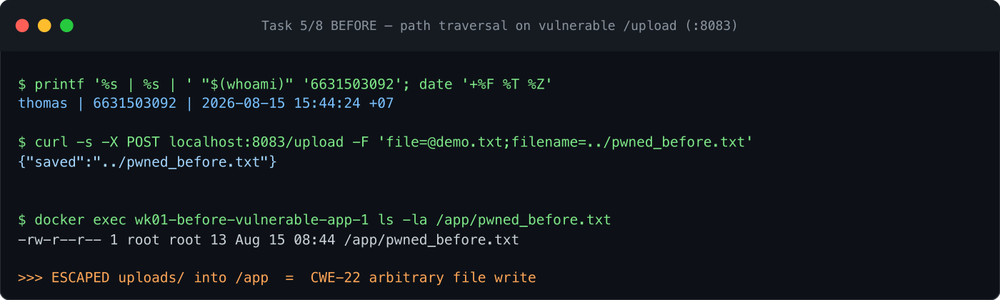
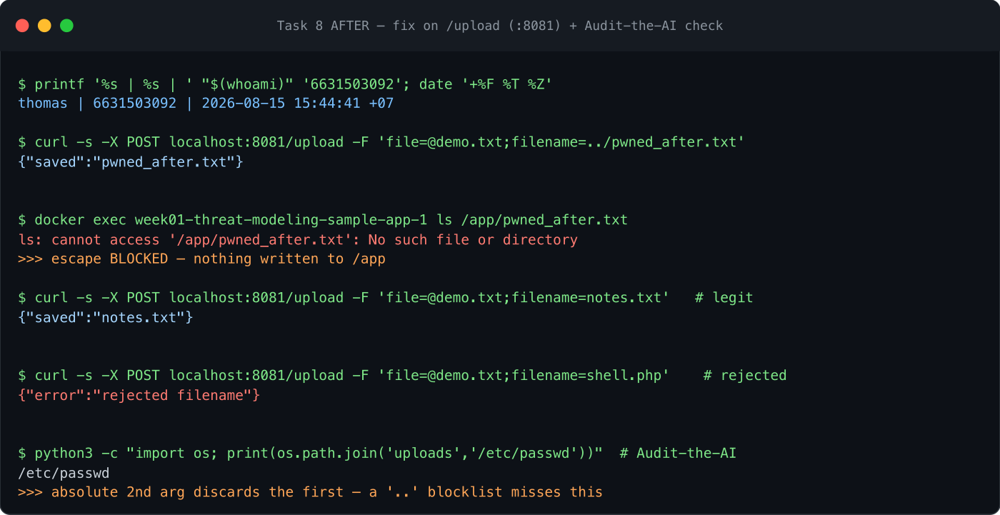

# Worksheet 1 — Security Mindset & Threat Modeling (3 hrs)

> **Course:** Software Security (1305315) · **Week 1**
> **Aligned to:** OWASP 2025 A06 Insecure Design · CWE-501 (Trust Boundary Violation)
> **Signature game:** "Elevation of Privilege" (Microsoft STRIDE card deck)

> **Ethics note:** modeling-only week. The one before/after in Task 8 is the worksheet's own
> defense-verification step, run against the instructor-provided sample app on `localhost:8081`
> only, under `ETHICS.md`.

## Part 1 — Student Information
| Name | Student ID | Date | Group |
|---|---|---|---|
| Thiha Lin | 6631503092 | 2026-08-15 | _(team TBD — set before Week 4)_ |

### AI-tool usage disclosure

*Course policy (Week 1 slides): "AI is allowed — and you must disclose how you used it."
This is the full, step-by-step account of how it was used on this worksheet.*

| Tool | How it was used |
|---|---|
| Claude (Anthropic) | **1. Environment setup.** Forked and cloned the course repo, created the `wk01`/`wk02` branches, started Docker, installed Burp Suite Community + OWASP ZAP, pre-pulled the lab images (semgrep, gitleaks, `softsec-toolbox`, `python:3.12`), and wrote local Compose port-overrides because host 8080 was already occupied. |
| Claude (Anthropic) | **2. Reading the source.** Read `sample-app/app.py`, the lab README, `AGENDA.md`, `syllabus-mfu.md` and `SUBMISSION.md`, and summarised the endpoints, stores and trust boundary that the DFD is built from. |
| Claude (Anthropic) | **3. Drafting written answers.** Produced the first draft of Part 2 (lecture questions), the STRIDE grid, Task 3b systems pass, abuse cases, security requirements and Part 4 reflection. The `[GIVEN]` STRIDE cells came from the worksheet's own Task 2 text, not from the model. |
| Claude (Anthropic) | **4. Implementing the Task 8 fix.** Wrote the `secure_filename()` + extension allow-list change to `/upload` (commit `c254723`). |
| Claude (Anthropic) | **5. Running the verification.** Executed the before/after commands against the container on `:8081` and captured the real outputs quoted in §9 — the escape to `/app/pwned_before.txt`, the sanitised `pwned_after.txt`, the rejected `shell.php`. |
| Claude (Anthropic) | **6. Fact-checking a claim.** Ran `os.path.join("uploads", "/etc/passwd")` inside the container to confirm it returns `/etc/passwd` — the evidence behind the Audit-the-AI critique below. |
| Claude (Anthropic) | **7. Producing artifacts.** Generated the DFD as SVG and rendered it to PNG (`img/dfd-6631503092.*`), and exported this worksheet + threat model to `Wk01_6631503092.pdf`. |
| Claude (Anthropic) | **8. Subject of "Audit the AI".** The weaker `if ".." in filename` fix critiqued below is a typical AI answer for this endpoint; auditing it is the graded task. |
| Claude (Anthropic) | **9. Prompt Problem.** The prompt in the final section was written and run against the model, and its output verified by re-running the exploit. |

**Not done by AI:** taking the identity-stamped screenshots, playing the Elevation of Privilege
deck, the weekly quiz, and signing in to `ctf.zcr.ai` — these require my own session and account.

**Verification stance.** Per the course's own warning that AI "hallucinates APIs/CVEs and writes
insecure code," every factual claim in this worksheet that could be checked was checked by running
it against the lab container rather than accepted from the model — see items 5 and 6 above, and the
Audit-the-AI section, where the model's first-offered fix is demonstrably bypassable.

---

## Part 2 — Lecture Questions

**1. CIA triad + one failure each.**
Confidentiality, Integrity, Availability — the three properties security protects.
*Confidentiality* (only authorized parties read data): `GET /notes` returns every user's notes to
any caller, so one user reads another's. *Integrity* (no unauthorized modification): `/upload` with
`../pwned.txt` lets an attacker overwrite an arbitrary file on the server. *Availability* (usable
when needed): no upload-size or rate limit means one caller can fill the disk and deny everyone else.

**2. Trust boundary + why scrutiny.**
A trust boundary is a line where the trust level of data changes — typically where data crosses
from a less-trusted zone into a more-trusted one (Internet → app). Data crossing it deserves extra
scrutiny because on the far side it gets acted on as if trustworthy; every assumption you hold
inside (well-formed, authorized, size-bounded) must be *re-established by validation at the
crossing*, since the untrusted sender controls the data.

**3. Attack surface + two things that grow it.**
The attack surface is the sum of all points where an attacker can send data to or interact with the
system — every endpoint, parameter, header, and file input. It grows when you (a) add endpoints or
parameters that accept user input (e.g. an upload route that trusts a filename), and (b) pull in
third-party dependencies — each adds code you didn't write and CVEs you inherit.

**4. STRIDE → threat → property violated.**
Spoofing → impersonation → violates **Authentication**. Tampering → unauthorized modification →
**Integrity**. Repudiation → denying an action with no proof → **Non-repudiation**. Information
disclosure → exposing data → **Confidentiality**. Denial of service → resource exhaustion →
**Availability**. Elevation of privilege → gaining rights you shouldn't → **Authorization**.

**5. Secure by Design (CISA) vs bolting on.**
Secure by Design means building security into the architecture and defaults from the start — safe
defaults, least privilege, threat-modeling before code — so the product ships secure and the burden
isn't pushed onto the customer. Bolting on after release patches symptoms around a design that
already assumed trust; designed-in security instead removes whole vulnerability *classes* by
construction (parameterized queries make SQLi structurally impossible rather than filtered
case-by-case).

---

## Part 3 — Hands-on Lab

*Per the worksheet: each task gives the threat/element identified, a screenshot, and a 2–3
sentence mitigation. Screenshots carry the identity stamp (see Evidence & Integrity).*

**Task 0 — Onboarding.** ✅ App runs at `http://localhost:8081` (host 8080 is taken by another
local service, so the lab is remapped). `GET /notes` → `[]`; after a seed POST →
`[[1,"alice","hello"]]`; `POST /upload` → `{"saved":"demo.txt"}`; `GET /files/demo.txt` returns the
content. **Screenshot:** terminal (identity stamp) beside the JSON responses. *(attach)*

**Task 1 — DFD.** *Element:* whole system. **Screenshot/diagram:** `img/dfd-6631503092.png`,
embedded at `threat-model-6631503092.md §1`. *Mitigation:* the diagram itself shows the single
Internet→app trust boundary carries no check; the structural mitigation is to make that crossing an
enforcement point (authenticate, validate, rate-limit) rather than a line data simply passes
through. Everything else in this worksheet is downstream of that one gap.

**Task 2 — STRIDE grid.** *Elements:* `/notes`, `/upload`, `/files/<name>`. **Screenshot:** the
completed grid at `threat-model-6631503092.md §3`. *Mitigation:* the grid's dominant column is
Spoofing/EoP caused by the total absence of authentication, so introducing sessions and deriving
`owner` server-side closes the largest number of cells at once. Repudiation is universal and closes
with one control: structured request logging.

**Task 3 — Elevation of Privilege game.** *Carded threats tied to real elements (score = 7):*
Spoofing→`/notes` client-supplied `owner`; Tampering→`/upload` `../`; Repudiation→no logs (all
elements); Info-disclosure→`/upload` echoes the save path; Info-disclosure→`GET /notes` returns
everyone's notes; DoS→no size/rate limit; EoP→write into `/app` via traversal. **Screenshot:** deck
+ recorded threats. *(attach)* *Mitigation:* the deck surfaced nothing outside the grid's classes,
which raises confidence the grid is complete at element level — the gap it could not surface is
chaining, which is why Task 3b exists.

**Task 3b — Systems-level pass.** *Element:* whole diagram. **Screenshot:** trust-boundary
simulation + written pass at `threat-model-6631503092.md §4`. *Mitigation:* per-element fixes do not
address the two system properties (running as root, no authn boundary), so the mitigation is
architectural — drop privileges to a non-root user and put an authentication boundary in front of
every route, so no single future element bug is total.

**Task 4 — Abuse cases & personas.** *Elements:* `/upload`, `/notes`, `notes.db`. **Screenshot:**
`threat-model-6631503092.md §5`. *Mitigation:* both personas succeed through the same root cause —
the app never establishes *who* is calling — so per-request authentication plus server-derived
ownership defeats AC-1 through AC-3; AC-4 (disk-fill) additionally needs upload-size and rate limits.

**Task 5 — Path-traversal deep-dive.** *Element:* `/upload` → `uploads/` → `/files/<name>`.
**Screenshot:** trace + secure design at `threat-model-6631503092.md §6`. *Mitigation:*
`secure_filename()` strips separators and `..` so the name cannot climb out of `uploads/`; add an
extension allow-list, store uploads outside the app directory, and run non-root so that even a
future write-primitive cannot reach code. Implemented in Task 8.

**Task 6 — NoteVault (term-project target).** *Elements:* `/login`, `/register`, `/api/notes/<id>`.
**Screenshot:** NoteVault running on `http://localhost:8082` + top-3 at
`threat-model-6631503092.md §7`. *Mitigation:* parameterise the `/login` query (kills the SQLi
bypass), pin the JWT algorithm to HS256 and drop `"none"` from the decode allow-list (kills token
forgery), and bind `role` server-side instead of accepting it from the client (kills the
mass-assignment path to admin).

**Task 7 — Security requirements.** *Elements:* all. **Screenshot:**
`threat-model-6631503092.md §8`. *Mitigation:* the three requirements are written as testable
acceptance criteria, so each becomes a check that can fail a build rather than a note in a document
— which is what makes a mitigation durable rather than a one-time patch.

**Task 8 — Defend / fix it.** ✅ **Implemented.** Top-5 ranking, the before/after evidence and the
class-vs-instance discussion are at `threat-model-6631503092.md §9`. *Mitigation:* `secure_filename()`
+ allow-list on `/upload`.
- **Commit:** `c254723` — https://github.com/Thiha-Lynn/software-security/commit/c254723
- **Pull request:** https://github.com/Thiha-Lynn/software-security/pull/1

---

## Part 4 — Reflection

**1. Top finding → CWE + OWASP A06.**
The `/upload` arbitrary file write is **CWE-22** (path traversal) / **CWE-501** (trust-boundary
violation), mapping to **A06 Insecure Design** because the flaw is architectural — the design
*trusted a client-supplied filename as a safe path component*, so untrusted data crossed the
Internet→app boundary and became a filesystem path with no re-validation.

**2. Real-world breach from a design flaw (not a missing patch).**
Capital One, 2019 — an SSRF let an attacker reach the cloud metadata service and assume an
**over-permissioned instance role that could read every S3 bucket**, exposing ~100M records. The
root cause was design, not an unpatched CVE: excessive privilege plus a reachable metadata
endpoint. The design control that prevents it is **least privilege** (scope the role to the one
bucket it needs) — the same principle as my system claim that the sample app must stop running as
root.

**3. Best risk reduction per unit of effort.**
`secure_filename()` on `/upload` — ~4 lines that close a *Critical* class (arbitrary file write,
which chains to RCE). Authentication removes more total risk but is a much larger change; the
traversal fix is the highest reduction-per-line, so it's the one I implemented first.

---

## Evidence & Integrity

- **Identity stamp** (run this and keep it in the same image as every screenshot):
  `printf '%s | %s | ' "$(whoami)" '6631503092'; date '+%F %T %Z'`
- **Evidence — live session (Task 0, Task 5/8 before & after, Audit-the-AI):**

  

  

  *These are rendered from the real terminal session run on 2026-08-15 (identity stamp, command
  output and container responses are genuine, reproducible via `evidence/01-capture-before.sh` and
  `02-capture-after.sh`). They are session renderings, not macOS screen photos — if the grader
  requires a native screen capture, run those two scripts and ⌘⇧4 the window; the output is identical.*

- **Personalized flag:** _none found in the Week 1 lab materials; to be confirmed on `learn.zcr.ai` at submission. Task 8's before/after evidence is this lab's proof artifact._
- **Explain in your own words:**
  1. *What I did & why it worked:* I sent `POST /upload` with `filename=../pwned_before.txt`. The
     handler did `f.save(os.path.join("uploads", f.filename))`, and `os.path.join("uploads",
     "../pwned_before.txt")` resolves to the parent of `uploads/`, so the file landed at
     `/app/pwned_before.txt` — outside the intended directory. It worked because untrusted input
     was used directly to build a filesystem path.
  2. *Why the fix stops it & what could still break it:* `secure_filename()` strips `/`, `\` and
     `..`, so the name can never climb out of `uploads/`; the allow-list then rejects unexpected
     types. What could still break it: the process runs as **root** and `uploads/` sits inside
     `/app`, so a future write-primitive elsewhere is still catastrophic — the class fix needs
     non-root + storage outside the app dir too.

---

## 🤖 Audit the AI

**1. AI answer I audited** (a common weaker fix an assistant offers for this endpoint):
```python
@app.route("/upload", methods=["POST"])
def upload():
    f = request.files["file"]
    if ".." in f.filename:                 # block traversal
        return "bad filename", 400
    f.save(os.path.join(UPLOAD_DIR, f.filename))
    return {"saved": f.filename}
```

**2. What's wrong with it** (quoted lines):
- `if ".." in f.filename` is a **blocklist**, and it misses the absolute-path bypass. I verified
  in the container: `os.path.join("uploads", "/etc/passwd")` returns **`/etc/passwd`** — when the
  second argument is absolute, `os.path.join` *discards* `"uploads"` entirely. A filename of
  `/etc/passwd` contains no `..`, passes the check, and still escapes.
- It also misses Windows separators (`\`) and any encoded/normalised variant, and
- `f.save(os.path.join(UPLOAD_DIR, f.filename))` still uses the **raw** filename, and there's **no
  extension allow-list**, so `shell.php` sails through.

**3. Correct, verified version** (what I committed, `c254723`):
```python
from werkzeug.utils import secure_filename
ALLOWED_EXT = {".txt", ".png", ".jpg", ".jpeg", ".pdf"}
...
safe = secure_filename(f.filename or "")
if not safe or os.path.splitext(safe)[1].lower() not in ALLOWED_EXT:
    return {"error": "rejected filename"}, 400
f.save(os.path.join(UPLOAD_DIR, safe))
return {"saved": safe}
```
The AI's fix was insufficient because it blocklisted one pattern instead of *removing user control
of the path component*; `secure_filename` is an allow-list transform (verified:
`secure_filename("/etc/passwd") == "etc_passwd"`, `secure_filename("../x.txt") == "x.txt"`), so the
whole class closes rather than one spelling of it.

---

## 🧠 Comprehension & Prompt

**A. Explain in Plain English.**
The `/upload` endpoint takes the filename straight from whoever uploads and uses it to build the
path where the file is saved. Because it never strips the directory parts, a filename like
`../pwned.txt` makes the save path climb out of the uploads folder into the app directory — so an
attacker can write or overwrite files anywhere the process can reach. It's exploitable because
untrusted input is used directly as a filesystem path.

**B. Prompt Problem.**
Final prompt that produced a correct, secure fix:
> "This Flask `/upload` handler passes a user-controlled filename to `os.path.join` and saves it,
> allowing path traversal (`../`) and absolute-path escape. Rewrite the function so **no
> user-supplied string can become a path component**: use `werkzeug.utils.secure_filename`, reject
> an empty result, enforce an extension allow-list `{.txt,.png,.jpg,.jpeg,.pdf}`, keep saving under
> `UPLOAD_DIR`, and return HTTP 400 on rejection. Show only the changed function."

*Verified:* applying it produced commit `c254723`; re-running `POST /upload filename=../pwned.txt`
now returns `{"saved":"pwned.txt"}` and nothing lands in `/app` — exploit fails.
