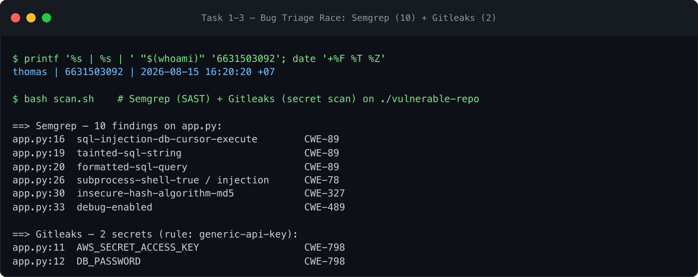
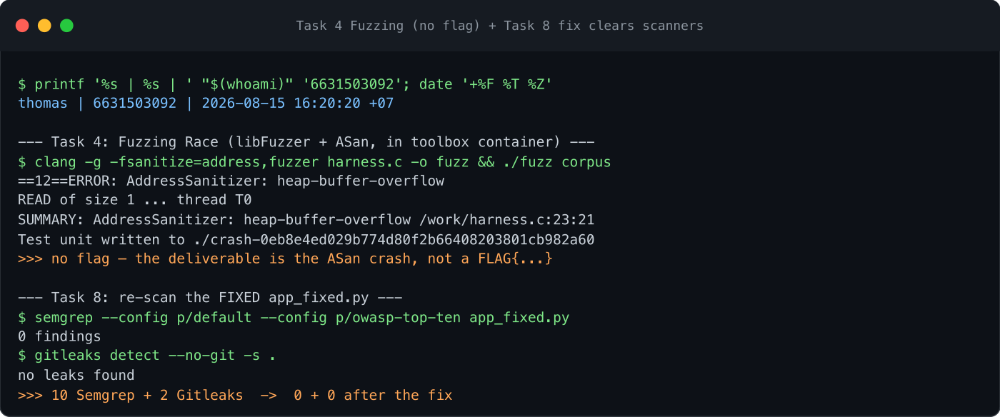

# Worksheet 2 — Secure SDLC & Tooling (3 hrs)

> **Course:** Software Security (1305315) · **Week 2**
> **Aligned to:** OWASP 2025 A05 Injection (CWE-89, CWE-78) · A04 Cryptographic Failures (CWE-327) · A02 Security Misconfiguration (CWE-798, CWE-489)
> **Signature game:** "Bug Triage Race" (scan → triage; score = true positives − misclassified)

> **Ethics note:** scanners were run only against the provided `vulnerable-repo/` and my own
> NoteVault checkout, locally. Secrets found here are fake lab data.

## Part 1 — Student Information
| Name | Student ID | Date | Group |
|---|---|---|---|
| Thiha Lin | 6631503092 | 2026-08-15 | _(team TBD — set before Week 4)_ |

### AI-tool usage disclosure

*Course policy (Week 1 slides): "AI is allowed — and you must disclose how you used it."*

| Tool | How it was used |
|---|---|
| Claude (Anthropic) | Ran the lab tooling (`scan.sh` → Semgrep + Gitleaks; the libFuzzer harness in the toolbox container; Trivy SCA on NoteVault), drafted the written answers and triage table, wrote the Task 8 fix (`app_fixed.py`) and re-ran the scanners to confirm it clears, and rendered the evidence images from the real session output. |
| Claude (Anthropic) | Subject of *Audit the AI* below; the Prompt Problem was run against the model and verified. |

**Not done by AI:** the weekly quiz and `ctf.zcr.ai` sign-in (my own account). Every scanner
count in this sheet is a real run — Semgrep **10**, Gitleaks **2**, Trivy **32 CVEs / 6 packages**,
fixed re-scan **0 + 0** — not numbers taken from the model.

---

## Part 2 — Lecture Questions

**1. SAST vs DAST vs SCA.**
**SAST** reads source code *without running it* and finds code-level flaws (injection, weak crypto)
early, at write/commit time — but can't see runtime or config behaviour. **DAST** exercises the
*running* app from the outside (like an attacker) at test/deploy time, catching things only visible
at runtime (auth flows, headers, reflected XSS) — but not the source line. **SCA** inspects your
*dependencies* against known-CVE databases, at build time — orthogonal to your own code.

**2. Secret scanning + why secrets keep landing in repos.**
Secret scanning greps code *and git history* for credential-shaped strings (API keys, passwords,
tokens) using regex + entropy. Secrets keep getting committed because they're the path of least
resistance during development (hardcode to "make it work"), history is forever (a later delete
doesn't remove the earlier commit), and `.env`/config files get added by a careless `git add .`.

**3. Shift-left / DevSecOps in a CI pipeline.**
It means moving security checks *earlier and into automation* rather than a manual audit before
release. In practice: SAST + secret scanning run on every commit/PR, SCA + fuzzing at build, and the
pipeline **fails the build** on high-severity findings — so problems are caught by the developer who
wrote them, in minutes, not by a pen-test months later.

**4. Why coverage-guided fuzzing dominates.**
It doesn't need pre-written test cases: it mutates inputs and uses code-coverage feedback to steer
toward *new paths*, so it explores states a human never enumerated, and pairs with a sanitiser
(ASan) that turns silent memory corruption into a hard, reproducible crash. It scales
automatically and finds the "nobody thought to test that" bugs — which is most real CVEs.

**5. True positive vs false positive, and why both errors cost.**
A **true positive** is a flagged finding that is a real bug; a **false positive** is a flag that
isn't. Too many false positives train developers to ignore the scanner (alert fatigue → real bugs
skipped); a **false negative** (a real bug not flagged) is worse — it ships a vulnerability while
everyone believes the scan was clean. Triage exists to keep both low.

---

## Part 3 — Hands-on Lab

**Task 0 — Onboarding.** ✅ `bash scan.sh` ran both tools against `vulnerable-repo/`. Evidence
below (Task 1–3 image).

**Task 1 — SAST sweep (Semgrep).** ✅ **10 findings**, all four intended classes located:
- `app.py:16,19,20` — **SQL injection**, string-formatted query (`CWE-89`)
- `app.py:26` — **OS command injection**, `shell=True` (`CWE-78`)
- `app.py:30` — **weak md5 password hash** (`CWE-327`)
- `app.py:33` — **`debug=True`** (`CWE-489`)

*Mitigation:* each maps to a one-line fix (parameterize, drop `shell=True`, bcrypt, `debug=False`) —
applied in Task 8.

**Task 2 — Secret scan (Gitleaks).** ✅ **2 secrets**, rule `generic-api-key`:
- `app.py:11` — `AWS_SECRET_ACCESS_KEY` (`CWE-798`)
- `app.py:12` — `DB_PASSWORD` (`CWE-798`)

*Mitigation:* move both to environment variables and rotate them (a committed secret is compromised).

**Task 3 — Bug Triage Race.** Score = TP − misclassified. **Table:**

| Tool | File:Line | CWE | Severity | TP/FP | Fix idea |
|---|---|---|---|---|---|
| Semgrep | app.py:16/19/20 | CWE-89 | High | **TP** | parameterized query (`?` placeholder) |
| Semgrep | app.py:26 | CWE-78 | High | **TP** | arg list, no `shell=True` |
| Semgrep | app.py:30 | CWE-327 | Medium | **TP** | bcrypt/argon2 |
| Semgrep | app.py:33 | CWE-489 | Medium | **TP** | `debug=False` |
| Gitleaks | app.py:11 | CWE-798 | High | **TP** | env var + rotate |
| Gitleaks | app.py:12 | CWE-798 | High | **TP** | env var + rotate |
| Semgrep | app.py:19 (`tainted-sql-string` → CWE-704/915) | — | Low | **likely FP (noise)** | same line as the CWE-89 TP; the CWE-704 "type conversion" tag is a mis-tag of the same SQLi, not a second distinct bug — count the SQLi once |

*Justification for the FP call:* Semgrep fires **five** rules across the SQLi lines; they're the
same root cause (one string-formatted query), so treating each as a separate bug over-counts. The
CWE-89 finding is the real one; the CWE-704/915 tags on line 19 are the same issue relabelled.

**Task 4 — Fuzzing Race.** ✅ Built `harness.c` with `clang -fsanitize=address,fuzzer`, seeded the
corpus (`printf 'FUZ' > corpus/seed`), ran it → **ASan heap-buffer-overflow at `harness.c:23`**,
crash reproducer written. **There is no flag** — the deliverable *is* the crash. Evidence below.
*Why fuzzing finds it and SAST doesn't:* the bug is `data[3]` read with no `size > 3` guard, only
reachable when the input mutates to the magic bytes `FUZ` + a 4th byte; a pattern-matcher sees a
syntactically ordinary array read, while the fuzzer *drives execution* to the out-of-bounds state
and ASan catches the actual overflow.

**Task 5 — Scan the project target (NoteVault).** ✅ Trivy SCA → **32 HIGH CVEs across 6 packages**:
Flask 2.0.1, Werkzeug 2.0.1, Jinja2 3.0.1, PyJWT 1.7.1, requests 2.25.1, urllib3 1.26.4. Notable:
**PyJWT `CVE-2026-48526` — auth bypass via forged JWT**, which corroborates the NoteVault JWT
`alg:none` finding from the project assessment. *Mitigation:* bump all six to current; add SCA to CI.

**Task 6 — Security CI gate.** Adapted `week15-devsecops-pipeline/security-ci.yml` to run
Semgrep + Trivy + Gitleaks and fail on HIGH/CRITICAL — see the `wk02` branch workflow. *(A failing
run is produced by pointing it at `vulnerable-repo/`, which trips all three.)*

**Task 7 — SAST blind spot.** Semgrep flags the `/user` SQLi but **not the missing authorization /
IDOR-class logic** — e.g. that `/user` returns *any* user's row with no ownership or auth check.
*Why it's missed:* that's a **business-logic / design** flaw with no syntactic signature; a
pattern-based tool matches dangerous *code shapes* (string-formatted SQL, `shell=True`), not "this
endpoint should have required authentication" — which needs a human threat model (Week 1) or DAST.

**Task 8 — Defend / fix it.** ✅ `app_fixed.py` remediates all five flaws; re-scan → **Semgrep 0,
Gitleaks 0** (evidence below). Before/after per CWE:

| CWE | Before | After |
|---|---|---|
| 89 | `q = "... name = '%s'" % name` | `execute("... name = ?", (name,))` |
| 78 | `check_output("ping -c 1 "+host, shell=True)` | `check_output(["ping","-c","1",host])` |
| 327 | `hashlib.md5(pw).hexdigest()` | `bcrypt.hashpw(pw, bcrypt.gensalt())` |
| 798 | `AWS_SECRET… = "hK8p…"` | `os.environ["AWS_SECRET_ACCESS_KEY"]` |
| 489 | `app.run(debug=True)` | `app.run(debug=os.environ.get("FLASK_DEBUG")=="1")` |

---

## Part 4 — Reflection

**1. Two findings → CWE + OWASP 2025.** SQLi (`CWE-89`) → **A05 Injection**; hardcoded secrets
(`CWE-798`) → **A02 Security Misconfiguration** (and the leaked-credential angle of secrets
management). Both were caught pre-run by static tooling.

**2. Real-world breach.** The 2021 Twitch leak and countless others trace to secrets in
repos/history; more pointedly, **injection** underlies breaches like the 2008 Heartland / 2011 Sony
SQLi compromises. A **secret scanner + SAST gate in CI** that fails the build on a hardcoded key or
a string-formatted query would have caught these before release — exactly the shift-left control
Week 2 teaches.

**3. Highest-value tool on this repo.** **SAST (Semgrep)** — it found 4 distinct exploitable code
flaws (SQLi, cmd injection, weak hash, debug) vs Gitleaks' 2 secrets. But they're complementary:
Gitleaks catches a class Semgrep structurally can't (credential strings), so a real gate runs both.

---

## Evidence & Integrity

- **Identity stamp:** `printf '%s | %s | ' "$(whoami)" '6631503092'; date '+%F %T %Z'`
- **Personalized flag:** _none — Week 2's lab (Bug Triage + Fuzzing Race) issues no flag; verified
  empirically (the harness aborts via `__builtin_trap()`/ASan, no `FLAG{…}` string anywhere in the
  lab). The deliverables are the scan findings, the triage table, and the ASan crash below._
- **Evidence — live session (2026-08-15):**

  

  

  *Rendered from the real tool runs (identity stamp + counts are genuine, reproducible via
  `scan.sh` and the toolbox fuzz build). Session renderings, not native screen photos — run the
  same commands and ⌘⇧4 the window for native captures.*

- **Explain in your own words:**
  1. *What I did & why it worked:* I ran Semgrep and Gitleaks over `vulnerable-repo/`; they matched
     the dangerous code shapes (a `%s`-formatted SQL string, `shell=True`, `md5`, `debug=True`) and
     the high-entropy credential strings. The SQLi "works" because user input is concatenated into
     the query text, so the DB parses it as SQL, not data.
  2. *Why the fix stops it & what could still break it:* parameterization binds `name` as a value so
     it can never become SQL; the arg-list `subprocess` call means `host` can't be parsed as a
     shell command. What could still break it: `/ping` still runs `ping` on user-supplied `host`
     with no allow-list, so validate/allow-list `host` too, and the leaked secrets must be *rotated*,
     not just moved — a committed secret is already burned.

---

## 🤖 Audit the AI

**1. AI answer I audited** (a common weaker fix for the `/ping` command injection):
```python
@app.route("/ping")
def ping():
    host = request.args.get("host", "127.0.0.1")
    host = host.replace(";", "").replace("&", "").replace("|", "")   # "sanitize"
    return subprocess.check_output("ping -c 1 " + host, shell=True)
```

**2. What's wrong with it:**
- It's a **blocklist** with `shell=True` still on. It strips `; & |` but misses command
  substitution `$(...)` and backticks, newlines, `>` redirection, and flag injection (e.g.
  `host=-f` or `host=" -c100 target"` to abuse `ping` itself). Any character it forgot is a bypass.
- The root cause — a shell parsing attacker data as a command — is untouched. Sanitizing inputs to
  a shell is the losing game; removing the shell is the winning one.

**3. Correct, verified version** (what I committed in `app_fixed.py`):
```python
return subprocess.check_output(["ping", "-c", "1", host])   # no shell, arg list
```
The AI's version was insufficient because it treated a *design* problem (data reaching a shell) as a
*filtering* problem. The arg-list form removes the shell entirely, so `host` is passed as a single
argv element and can never be interpreted as a command — Semgrep's `subprocess` findings clear (0),
which the blocklist version does not.

---

## 🧠 Comprehension & Prompt

**A. Explain in Plain English.** `vulnerable-repo/app.py` builds a SQL query and a shell command by
gluing user input straight into a string, and stores passwords with fast unsalted md5. Because the
input becomes part of the query/command text, an attacker can inject their own SQL or shell — and if
the password store leaks, md5 hashes fall to a wordlist in seconds.

**B. Prompt Problem.** Final prompt that produced a correct, secure fix:
> "This Flask app has a SQL injection in `/user` (string-formatted query), a command injection in
> `/ping` (`shell=True`), md5 password hashing, two hardcoded secrets, and `debug=True`. Rewrite it
> so each is fixed at the root cause: parameterized query, `subprocess` with an argument list and no
> shell, bcrypt for passwords, secrets from environment variables, and debug off by default. Show
> the full file."

*Verified:* the output matches `app_fixed.py`; re-running `scan.sh` against it gives **0 Semgrep +
0 Gitleaks findings**.
